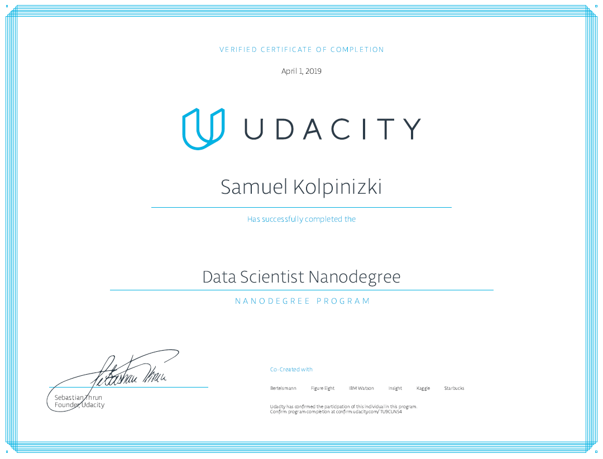

# Udacity Data Science Nanodegree portfolio

[**Certificate link**](https://graduation.udacity.com/confirm/TU9CUN54)

The sub-directories of this folder contain the Machine Learning / Data science projects completed as a requirement for graduation of this course.

Each sub directory contains a readme.md file describing the project.

## Short summary of projects
* Classification of pet adoption rates based on tabular/text/image data. 
Using Boosted Gradient methods, NLP and image feature extraction.
* ML pipeline for SMS classification in disaster areas using NLP and ensemble learning and showing results in Bootstrap generated dashboard.
* Recommendation system implementation on data from IBM WATSON platform. 
* Heroku web dashboard deployment for some predictive statistics from Google Play database. 
* Predictive modelling of solar panel deployment in the US. 
* Market segmentation for mail company in Germany utilising K-means clustering, PCA and various data wrangling methods. 
* Flower species classification (102 categories) with a deep neural network. 
* Model individual’s income using 1994 US census data using various supervised learning methods: Ensemble learning, Boosting, SVM, Naïve Bayes.

